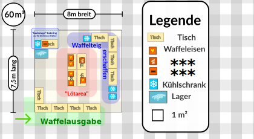

 36c3 Waffelplanung
==========================
Planung des C3WOC Stand bei Chaos West am 36c3

```txt
Aller Gewinn geht in gleichen Teilen an folgende Gruppen:
 + Netzpolitik.org -> https://netzpolitik.org/
 + Digitalcourage e.V. -> https://digitalcourage.org/
 + Fridays for Future Bodensee *(OG Friedrichshafen und Überlingen)* -> https://klima-streik.de/
```

 Diversitätsplanung
-----------------
> Was wird dieses C3WOC dort alles für Waffeln machen?
+ laktosefreie Waffeln
+ Maismehlwaffeln
+ normale Waffeln (mit Flora)
+ eventuell vegane Waffeln? *(Rezept nicht getestet: [twitter](https://twitter.com/kurorori/status/1141722414742745091))*
+ Dönerwaffel *(dafür ist der Dönerspieß)*


 Unterschied zum 35c3
--------------------------------
 + 1 Waffeleisen weniger als am 35c3
 + verbesserte Schichtplanung dank ~~Engelsystem~~ Einhornsystem -> [einhornsystem.de](https://einhornsystem.de) ``-> comming soon``
 + verbesserte Verpflegung für "Einhörner" dank der für Einhörner exklusiven Nutzung des [Sandwitchmaker](https://www.bartscher.com/de/Produkte/Grillen/Kontaktgrills/Kontaktgrill-1800-1R/p/A150670) *(hauptsächlich für die Aufbauzeit geplant)*
 + Bessere integration bei Chaos West dank der seit dem 35c3 geknüpften Kontakten.
 + offensivere bekanntgabe was mit potentiellen Gewinn bei Waffelspenden passiert
 + Tag 1 wird es **keine Waffeln** geben, da L3D da Geburtstag hat!
   - *Zumindest nicht Tagsüber oder am Nachmittag/Abend. Kurz vor/nach Mitternacht könnte es ausnahmen geben!*
   - Was bedeutet: Weniger Gewinneinbußen von Fairgourmet.

 Pläne
------
``Waffelstand.svg``


 Materialplanung
----------------
| Menge | Was | Strom  pro Gerät| von wem |
| ----- | --- | --------------- | ------- |
| 5 | Waffeleisen | ``2.2KW``   | L3D     | 
| 1 | Dönergrill  | ``3KW``     | [Toolbox](https://toolbox-bodensee.de) |
| 1 | Sandwitchmaker/Kontaktgrill | ``2.2 KW`` | L3D |
| 1   | Aufbaukühlschrank   | ``?``            | Dezentrale e.V. |
| 2-4 | Gastrokühlschränke | ``?``             | Carsten / Chaos West |
| etwas | Licht/Deko | ``?``                   | Carsten / Chaos West |
| 1 | eventuell Spülmachine??? | ``?``         | Carsten / Cahos West |

### Zusammenfassung Strom:
Es werden für die Waffelgeräte ca. 7 individuelle Schuko anschlüsse mit eigener Phase/Sicherung/was auch immer gebraucht.
Diese werden meistens mit 2.2KW (max 3KW) belastet. (siehe Tabelle)

Leistung der Kühlmöglichkeiten und Licht ist unbekannt...

In die Assembly Anmeldung wurden 26KW Strombedarf reingeschrieben... Das sollte hoffentlich mehr als genug sein!

### Was wird sonst noch Benötigt:
 * ca. 15  Tische *(zb. 150 x 80, sollten das Gewicht von min. 2 Waffeleisen aushalten)*
 * *Flausch*
 * *Liebe*
 * *tolleranz*
 * *harmonie*

### Ungeplante Elemente:
 + Wasser

```
Das Assemblyteam besorgt uns jetzt einen Wasseranschluss...
Wie der aussieht, was wir noch brauchen etc. ist unklar.
C.Epp wollte mal versuchen ob er eine Spüle und Spülmachine auftreiben kann... Ob das erfolg hat... ist unklar...
HILFE!!!
```

 Protokolle:
--------------
 + [Chaos West Kickoff](https://md.hasi.it/7HKVKnMbQICGNpvuZv4sYA?view#Was-brauchen-diese-%E2%80%9CWaffeln%E2%80%9D) ``2019-10-27``
